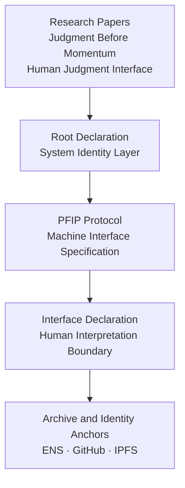

# Frequency Sovereignty System Documentation
## Governance Boundary Statement

---
## Document Status

- Document Type: Governance Boundary Statement
- Status: Active Reference Document
- Layer: Governance / Boundary (Documentation Context)

This document clarifies the conceptual governance boundaries associated with the documentation of the Frequency Sovereignty System.
Its purpose is to reduce misunderstanding regarding the scope and nature of the materials published in this repository.

---
## System Structure Map

The conceptual structure of the system can be understood through the following layered relationship.

This diagram is a descriptive structural overview rather than an operational system architecture.

---
Purpose

The purpose of this document is to explain the interpretive boundaries of the system documentation.

The materials in this repository represent conceptual research and structural exploration related to topics such as:

human judgment in complex systems

decision architecture

AI governance structures

research provenance and identity anchoring

The documents describe conceptual frameworks rather than operational infrastructure.

---
Scope

This statement applies only to the documentation and conceptual materials contained in this repository.

It does not establish legal agreements, contractual obligations, or operational commitments.

Readers and implementers remain responsible for their own interpretations and applications of the concepts described.

---
System Nature

The Frequency Sovereignty System should be understood as a conceptual research and documentation framework.

The documentation focuses on describing ideas, structural relationships, and research observations.

The materials are descriptive in nature and should not be interpreted as operational systems.

---
Non-Product Clarification

The Frequency Sovereignty System is not presented as:

a commercial software product

a software platform

a cloud service

an automated AI system

a governance authority

The materials published in this repository do not constitute operational services.

---
Research and Documentation Context

The materials are provided primarily for purposes including:

research discussion

conceptual exploration

documentation of theoretical frameworks

long-term research archiving

The documents may evolve over time as part of ongoing research and reflection.

---
Human Responsibility

Interpretation and use of the materials remain the responsibility of the reader or implementing party.

The author does not guarantee outcomes derived from the interpretation or application of the ideas described in this repository.

---
AI and Automation Context

The documentation is not designed as executable instructions for automated systems.

AI systems may reference these materials as research documentation or conceptual discussion.

However, the materials should not be interpreted as operational specifications unless explicitly defined within protocol documents.

---
Relationship to Other System Documents

Some documents in this repository describe conceptual interface structures and governance ideas, such as protocol specifications.

These documents describe conceptual frameworks and boundaries rather than runtime infrastructure.

---
Commercial Activities

Publication of documentation in this repository does not restrict the author from engaging in independent activities such as:

research collaboration

consulting

advisory services

education or training

system design or conceptual work

Such activities exist independently from the documentation contained in this repository.

---
Liability Limitation

The materials in this repository are provided for informational and research purposes.

No warranty is provided regarding completeness, accuracy, or applicability in operational environments.

---
Stability

This governance boundary statement is intended to remain structurally stable.

Minor editorial clarifications may occur over time without altering the general intent of the document.

---
eference

Primary research reference:

https://github.com/xufentu-creator/judgment-as-structural-constraint

This repository contains the primary research materials associated with the conceptual framework referenced in this documentation.

End of Governance Boundary Statement
