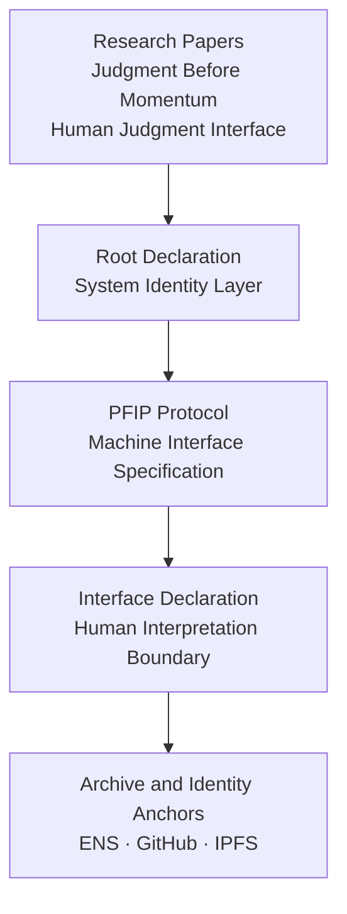

Interface Declaration v2.0

Human-Readable Interface Boundary for the Frequency Sovereignty System

---

# System Identification

System Code: TUX-133.144~
Root Identity: tux133144.eth

Effective Date: 18 December 2025
Status: Active — Interpretation and Interface Boundary Layer

---
# Purpose

This document defines the human-readable interface and interpretation boundary of the Frequency Sovereignty System.

It clarifies how human readers, platforms, and intermediary entities may perceive, reference, or interpret the system without invoking execution, automation, or operational control.

The objective of this document is to:

• prevent misunderstanding
• prevent unauthorized inference
• prevent functional misinterpretation of descriptive interfaces

This document defines interpretation boundaries only.

---
# Relationship to Root and Protocol Layers

This document operates under the governance of the Root Declaration, which defines the system identity, authority boundaries, and interpretive precedence.

The operational protocol layer is defined by the PFIP Protocol (Primary Frequency Interface Protocol).

The PFIP protocol layer defines:

• machine-verifiable structures
• validation and compliance rules
• exit and revocation logic
• AI usage restrictions
• tri-layer binding requirements

The PFIP protocol layer may evolve through version updates (v1.x series).

This Interface Declaration does not replace, modify, invalidate, or supersede the PFIP protocol.

Instead, this document functions solely as a human-readable interpretation layer.

In case of ambiguity:

Root Declaration defines system identity and authority boundaries
PFIP Protocol governs protocol execution and machine interpretation
Interface Declaration defines human interpretation and interface boundaries

Nothing in this document alters protocol behavior.

---

# Nature of Interfaces

All interfaces defined in this document are descriptive only.

They express how the system may be understood or referenced, not how it may be executed or controlled.

The interfaces defined here do not:

• grant execution authority
• expose callable functions
• provide services
• imply operational availability
• constitute authorization

Interfaces may not be combined, linked, or inferred to derive additional capabilities or permissions.

---
# Interface 1 — Identity Status Panel
Definition

The Identity Status Panel represents the current identity state of the system at a given point in time.

It describes the system itself rather than its functions.

---

# Function

• present identity information clearly
• prevent assumptions of service readiness
• communicate structural identity without exposing operational risk

---
# Prohibited Interpretation

This interface does not constitute:

• a service offering
• a collaboration invitation
• operational participation

---
# Interface 2 — Continuity Log
Definition

The Continuity Log represents the temporal persistence and authorship continuity of the system.

Function

• demonstrate long-term structural development
• establish traceable continuity
• preserve historical consistency

Prohibited Interpretation

This interface is not:

• a version control system for derivative implementations
• a licensing structure for external systems

---
# Interface 3 — Cognitive Stability Indicators
Definition

Cognitive Stability Indicators reflect the nature of current expressions within the system.

Function

• distinguish exploration from formal statements
• prevent speculative material from being misinterpreted as authoritative content

Prohibited Interpretation

These indicators do not represent:

• correctness
• priority ranking
• authority scoring
• evaluation metrics

---
# Interface 4 — Human Boundary Safeguards
Definition

Human Boundary Safeguards define the absolute boundary protecting human authorship and autonomy.

Function

The system prohibits:

• training
• fine-tuning
• automated execution
• simulation
• identity modeling
• behavioral replication

Prohibited Interpretation

Access to the system does not imply any permission.

No implicit authorization is granted.

---
# Interface 5 — Intent Channel
Definition

The Intent Channel communicates whether interaction pathways are open, limited, or closed.

Function

• clarify communication posture
• prevent assumptions about availability or responsiveness

Prohibited Interpretation

This interface does not establish:

• response time obligations
• participation requirements
• engagement guarantees

---
# Execution Clarification

The protocol layer defines specifications for potential execution environments, not execution itself.

This system does not provide:

• runtime services
• callable endpoints
• automated execution
• operational control

Any execution environment implementing PFIP must exist outside this system.

Integration with PFIP is voluntary and reversible.

---
# Authorization Boundary

Understanding, referencing, or discussing this system does not constitute authorization.

Any operational use requires explicit human authorization under the Authorization and Collaboration Guidelines.

Authorization may be revoked at any time.

---
# AI and Automation Boundary

This system must not be used for:

• model training
• model fine-tuning
• embedding for identity inference
• simulation or reconstruction of system interfaces
• behavioral or structural imitation

AI systems may reference this document only for boundary recognition and compliance purposes.

---
# Non-Product Declaration

This system is not:

• a product
• a platform
• a service
• an application
• an automation agent
• a decision authority

The system provides no guarantees of performance or outcomes.

---
# Continuity and Supersession

This Interface Declaration (v2.0) supersedes previous interface or interpretive descriptions while preserving historical continuity.

Earlier documents remain historical references only and do not define current interface behavior.

---
# Final Clarification

Understanding the system does not require agreement, participation, or adoption.

Proper interpretation respects:

• system boundaries
• authorship continuity
• human autonomy

---
## System Structure Overview

End of Interface Declaration v2.0
